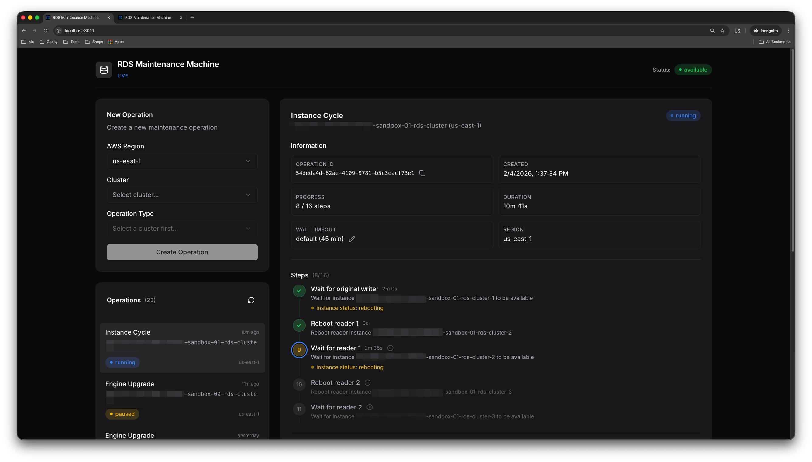

# RDS Maintenance Machine

A state machine engine for low/zero-downtime Aurora RDS maintenance operations.



## What

RDS Maintenance Machine automates complex Aurora PostgreSQL/MySQL cluster
maintenance operations that would otherwise require careful manual coordination:

- **Instance Type Changes** - Upgrade or downgrade instance classes (zero
  downtime via failover)
- **Storage Type Changes** - Migrate between storage types (zero downtime)
- **Engine Upgrades** - Major/minor version upgrades using Blue-Green
  deployments (near-zero downtime; brief interruption during switchover for DNS
  propagation)
- **Instance Cycling** - Rolling reboots to apply pending parameter changes
  (zero downtime via failover)

## Why

Aurora cluster maintenance typically involves multiple AWS API calls with
specific ordering, wait conditions, and failover coordination. Manual execution
is error-prone and time-consuming. This tool:

- **Minimizes downtime** - Creates temporary instances and orchestrates
  failovers; Blue-Green switchover requires brief client reconnection
- **Provides visibility** - Web UI shows real-time progress and step-by-step
  status
- **Enables control** - Pause, resume, or abort operations at any point
- **Handles complexity** - Manages RDS Proxy retargeting, parameter groups, and
  Blue-Green deployments automatically

## Supported Operations

### Instance Type Change

Changes the instance class for all instances in a cluster with zero downtime.

1. Creates a temporary instance with the new instance type
2. Fails over to the temporary instance (brief connection blip)
3. Modifies the original writer instance to the new type
4. Modifies all reader instances to the new type
5. Fails back to the original writer (brief connection blip)
6. Deletes the temporary instance

### Storage Type Change

Migrates cluster storage between types (e.g., io1 to gp3) with zero downtime.

1. Creates a temporary instance with the new storage type
2. Fails over to the temporary instance (brief connection blip)
3. Modifies the original writer instance to the new storage type
4. Modifies all reader instances to the new storage type
5. Fails back to the original writer (brief connection blip)
6. Deletes the temporary instance

### Engine Upgrade (Blue-Green)

Upgrades the PostgreSQL/MySQL engine version using AWS Blue-Green deployment.

1. Copies custom parameter groups to the new engine version
2. Creates a Blue-Green deployment (AWS provisions a replica cluster and
   snapshot)
3. Waits for the green environment to be ready and in-sync
4. Performs the switchover (requires client reconnection)
5. Retargets any RDS Proxies to the new cluster
6. Cleans up the old (blue) environment

### Instance Cycle (Reboot)

Performs rolling reboots across all instances to apply pending parameter
changes.

1. Creates a temporary instance
2. Fails over to the temporary instance (brief connection blip)
3. Reboots the original writer instance
4. Reboots all reader instances sequentially
5. Fails back to the original writer (brief connection blip)
6. Deletes the temporary instance

All operations persist state to disk and can be paused, resumed, or aborted at
any step. The Web UI provides real-time visibility into progress.

## Quick Start

```bash
# create .env and configure aws credentials
cp .env.example .env

# start server via docker at http://localhost:3010
make server
```

Other commands:

```bash
make server-logs   # view logs
make server-stop   # stop server
```

Or build and run directly:

```bash
# set aws credentials
export AWS_REGION=us-east-1
export AWS_PROFILE=your-profile

# run server locally at http://localhost:3000
make build-server
./var/dist/server
```

## Configuration

| Variable                    | Default     | Description                          |
| --------------------------- | ----------- | ------------------------------------ |
| `APP_PORT`                  | `3000`      | HTTP server port                     |
| `APP_BASE_PATH`             | (empty)     | URL path prefix (e.g., `/rds-maint`) |
| `AWS_REGION`                | `us-east-1` | Default AWS region                   |
| `AWS_PROFILE`               | (empty)     | AWS credentials profile              |
| `APP_DATA_DIR`              | `./data`    | Directory for persistent storage     |
| `APP_AUTO_RESUME`           | `true`      | Resume running operations on restart |
| `APP_DEFAULT_WAIT_TIMEOUT`  | `2700`      | Wait timeout in seconds (45 min)     |
| `APP_DEFAULT_POLL_INTERVAL` | `30`        | Poll interval in seconds             |
| `APP_SLACK_TOKEN`           | (empty)     | Slack bot token for notifications    |
| `APP_SLACK_CHANNEL`         | (empty)     | Slack channel for notifications      |
| `APP_ADMIN_TOKEN`           | (empty)     | Bearer token for admin endpoints     |
| `APP_DEBUG_ENABLED`         | `false`     | Enable debug logging                 |

The server listens on port `3000` by default (configurable via `APP_PORT`).

## AWS IAM Permissions

The following IAM permissions are required:

```json
{
  "Version": "2012-10-17",
  "Statement": [
    {
      "Sid": "RDSClusterOperations",
      "Effect": "Allow",
      "Action": [
        "rds:DescribeDBClusters",
        "rds:ModifyDBCluster",
        "rds:FailoverDBCluster",
        "rds:DeleteDBCluster"
      ],
      "Resource": "*"
    },
    {
      "Sid": "RDSInstanceOperations",
      "Effect": "Allow",
      "Action": [
        "rds:DescribeDBInstances",
        "rds:CreateDBInstance",
        "rds:ModifyDBInstance",
        "rds:DeleteDBInstance",
        "rds:RebootDBInstance"
      ],
      "Resource": "*"
    },
    {
      "Sid": "RDSSnapshotOperations",
      "Effect": "Allow",
      "Action": [
        "rds:CreateDBClusterSnapshot",
        "rds:DescribeDBClusterSnapshots"
      ],
      "Resource": "*"
    },
    {
      "Sid": "RDSParameterGroups",
      "Effect": "Allow",
      "Action": [
        "rds:DescribeDBClusterParameterGroups",
        "rds:DescribeDBClusterParameters",
        "rds:CreateDBClusterParameterGroup",
        "rds:ModifyDBClusterParameterGroup",
        "rds:DescribeDBParameterGroups",
        "rds:DescribeDBParameters",
        "rds:CreateDBParameterGroup",
        "rds:ModifyDBParameterGroup"
      ],
      "Resource": "*"
    },
    {
      "Sid": "RDSBlueGreenDeployments",
      "Effect": "Allow",
      "Action": [
        "rds:CreateBlueGreenDeployment",
        "rds:DescribeBlueGreenDeployments",
        "rds:SwitchoverBlueGreenDeployment",
        "rds:DeleteBlueGreenDeployment"
      ],
      "Resource": "*"
    },
    {
      "Sid": "RDSProxyOperations",
      "Effect": "Allow",
      "Action": [
        "rds:DescribeDBProxies",
        "rds:DescribeDBProxyTargetGroups",
        "rds:DescribeDBProxyTargets",
        "rds:RegisterDBProxyTargets",
        "rds:DeregisterDBProxyTargets"
      ],
      "Resource": "*"
    },
    {
      "Sid": "RDSDiscovery",
      "Effect": "Allow",
      "Action": [
        "rds:DescribeDBEngineVersions",
        "rds:DescribeOrderableDBInstanceOptions",
        "rds:ListTagsForResource"
      ],
      "Resource": "*"
    },
    {
      "Sid": "EC2Regions",
      "Effect": "Allow",
      "Action": ["ec2:DescribeRegions"],
      "Resource": "*"
    }
  ]
}
```

## HTTP API

| Method   | Path                            | Description                            |
| -------- | ------------------------------- | -------------------------------------- |
| `GET`    | `/`                             | Web UI                                 |
| `GET`    | `/api/config`                   | Public configuration                   |
| `GET`    | `/api/operations`               | List all operations                    |
| `POST`   | `/api/operations`               | Create new operation                   |
| `GET`    | `/api/operations/:id`           | Get operation details                  |
| `PATCH`  | `/api/operations/:id`           | Update operation (timeout, etc.)       |
| `DELETE` | `/api/operations/:id`           | Delete operation (created state only)  |
| `POST`   | `/api/operations/:id/start`     | Start operation                        |
| `POST`   | `/api/operations/:id/pause`     | Pause running operation                |
| `POST`   | `/api/operations/:id/resume`    | Resume paused operation                |
| `POST`   | `/api/operations/:id/reset`     | Reset to specific step                 |
| `GET`    | `/api/operations/:id/events`    | Get operation event log                |
| `GET`    | `/api/regions`                  | List available AWS regions             |
| `GET`    | `/api/regions/:region/clusters` | List clusters in region                |
| `GET`    | `/api/cluster`                  | Get cluster info (x-cluster-id header) |
| `GET`    | `/api/cluster/upgrade-targets`  | Get valid upgrade versions             |
| `GET`    | `/api/cluster/instance-types`   | Get available instance types           |
| `GET`    | `/api/cluster/proxies`          | Get RDS Proxies for cluster            |
| `GET`    | `/api/cluster/blue-green`       | Get Blue-Green deployments             |

______________________________________________________________________

# Development

## Architecture

The application is a single Go binary that serves both the REST API and a React
single-page application. The React UI is built as static assets and embedded
into the Go binary at compile time using `go:embed`. This means:

- No separate web server or CDN is required
- The entire application (API + UI) runs as one process
- Deployment is a single binary with no external dependencies

## Project Structure

```
cmd/
  server/                # http server entry point
  demo/                  # demo mode with mock server
  verify/                # integration test harness
internal/
  app/                   # application logic and http routing
  app/ui/                # embedded react ui assets (built from ui/)
  machine/               # state machine engine and step handlers
  rds/                   # aws rds client wrapper
  storage/               # persistent storage (file-based)
  config/                # configuration loading
  mock/                  # mock rds api server for testing
  notifiers/             # slack notifications
ui/                      # react frontend source code
docs/                    # additional documentation
```

## Building

```bash
make build-server       # build server with ui
make build-ui           # build ui only
```

## Demo Mode

Demo mode runs a mock RDS API server so you can explore the UI and test
operations without affecting real AWS infrastructure.

```bash
make demo              # start demo mode
make demo-logs         # view logs
make demo-stop         # stop demo
```

Demo mode endpoints:

- `http://localhost:8080` - Web UI and API
- `http://localhost:9080` - Mock RDS API
- `http://localhost:9080/mock/state` - View/modify mock state

## Testing

```bash
make test              # run all tests
make test-unit         # run unit tests only
make test-verify       # run integration tests against mock server
```

## License

MIT License - see [LICENSE](LICENSE) for details.
